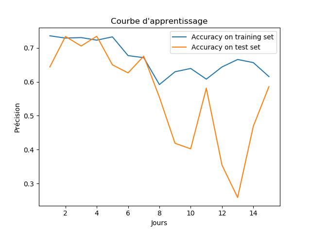

# Air Quality Prediction | FR
## I. Dataset :
Nous avons commencé par la récupération des données depuis UCI « Machine learning Repo », Le dataset contient 9357 lignes et 15 colonnes.
Les lignes représentent les mesures heure par heure des capteurs de composés inorganiques entre le 10/03/2004 et 4/4/2005, équivaux à 139 jours.
Les colonnes représentent les mesures des composés inorganiques détectés par les capteurs présents sur les différents sites.
Les composés inorganiques qu’ils sont mesurés sont :
-	03
-	CO
-	C6H6
-	NOx
-	NMHC
-	NO2
-	Températures
-	Humidité
## II. Préparation des données :
En se basant sur la qualité d’air des jours précédents, le projet consiste à prévoir la qualité d’air d’un jour X sans utiliser les capteurs.
Cependant, nous avons pu calculer la qualité d’air grâce à la formule utilisée par « Breeze Technologies »
La formule se représente comme ainsi :
La moyenne de toutes les mesures des composants polluants. Pour plus d’informations veuillez consulter le blog suivant : 
https://www.breeze-technologies.de/blog/what-is-an-air-quality-index-how-is-it-calculated/#:~:text=Our%20air%20quality%20index%20is%20calculated%20based%20on%20averages%20of,and%2010%3A00%20AM).
Concernant les composants polluants dans notre dataset, notre choix s’est positionné sur ceux qui contiennent du carbone qui sont : 
-	CO
-	C6H6
-	NMHC
Ainsi nous définissons la qualité d’air comme suit :
AirQuality = (CO + C6H6 + NMHC) / 3
Plus le résultat est grand plus la qualité d’air est mauvaise.
Comme nous l’avons indiqué précédemment le but du projet est de prédire la qualité d’air d’un jour en se basant sur les jours précédents, c’est pour cela que nous allons décaler notre dataset avec une variable que nous appellerons « période » à fin de récupérer la qualité d’air des jours précédents d’un jour J.

## III. Apprentissage :
Nous utilisons le modèle « random forest » car il est performant et ne demande aucun prétraitement des données.
Pour maximiser la précision du modèle, nous avons choisi les meilleurs paramètres en utilisant une recherche de grille avec une validation croisée. 
Ainsi nous optimiserons les paramètres suivant : 
-	n_estimators
-	max_depth
-	min_samples_split
-	min_samples_leaf
Les meilleurs paramètres sont : 
max_depth = 5, min_samples_leaf = 8, min_samples_split = 10, n_estimators = 160.
 
## III.2 Courbe d’apprentissage :

 
##  V. Résumé :
Les meilleurs modèles sont ceux qui se basent sur les 3 jours précédents et les 5 jours suivants.

